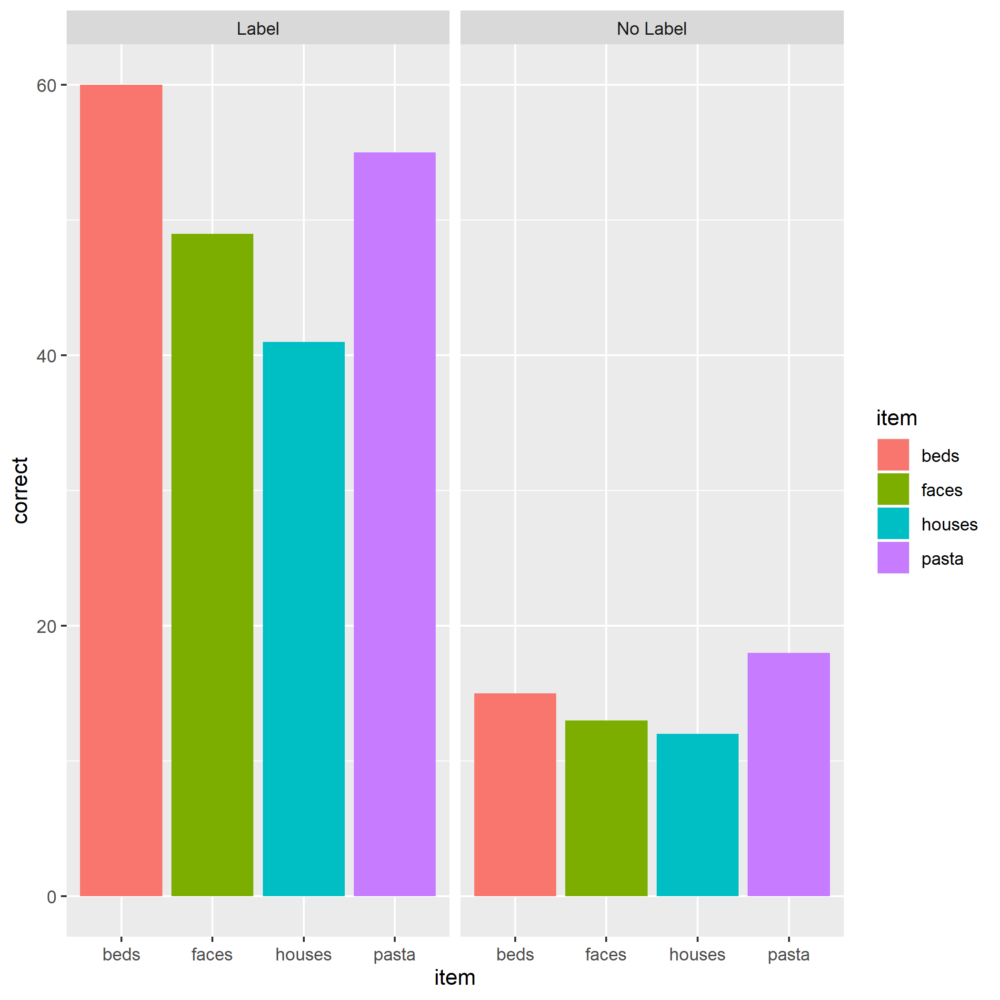

# Goals 

By the end of this tutorial, you will:

+ have a better understanding of tidyverse `verbs`
+ understand the basics of graphing in ggplot2
+ understand the basics of writing in RMarkdown (content in a separate document)

The best way to do this tutorial is to walk through it slowly, executing each line and trying to understand what it does. You can execute a single line by placing your cursor somewhere in that line and hitting CMD+enter on mac or CTRL+enter on PC. 

Make sure you load the tidyverse first!
```{r}
library(tidyverse)
```

# 1. Data tidying with `tidyr`
Much of this draws on the [tidy data chapter from 'R for Data Science'](http://r4ds.had.co.nz/tidy-data.html#tidy-data-1)

The two key verbs in **data tidying** are `spread` and `gather`. Each of these verbs relies on a key-value pair that contains a *key* that indicates *what* the information describes and a *value* that contains the actual information.

"Password: 0123456789"" is a key value pair. 0123456789 is the *value*, and it is associated with the *key* Password.

The `ps_data` we've been using is already *tidy*. Now, we'll look at some that are not! We'll use some datasets that are built into the tidyverse package. Each dataset has the same values of four variables, `country`, `year`, `population`, and `cases`, but each dataset organizes them in different ways.

Recall the "rules" for tidy data:
+ Each variable must have its own column.
+ Each observation must have it's own row.
+ Each value must have its own cell.

```{r eval = FALSE}
?table1 #let's learn about the datset
table1 #this dataset is tidy!
```
## 1.1. Gathering Data

A common problem is a dataset where some column names are not names of variables, but *values* of a variable. Check out `table4a`. 

```{r}
table4a
```

The column names `1999` and `2000` are not variables in our data, instead they represent values of the `year` variable, and each row represents two observations, not one. We need to *gather* these columns into a new pair of variables.

*gather* makes wide tables narrower and longer

There are three questions we must answer:
> 1. Which columns do we want to gather? 
> A: `1999` and `2000`
> 2. What is the name of the variable whose values form the column names (the *key*)? 
> A: year
> 3. What is the name of the variable that is spread out over the cells (the *value*)? > A: cases

We'll use these answers in the *gather* function:
```{r}
table4a %>% 
  gather(`1999`, `2000`, key = "year", value = "cases")

```

Note that we had to wrap 1999 and 2000 in back ticks. This is because they violate column naming rules (remember, they shouldn't start with numbers), and so we have to tell R more explicitly that these are in fact names with the back tick. 

### Exercise 1.1a. 
>`table4b` contains information about the `population` variable. Let's *gather* that table as well. Type `table4b` to check it out before gathering. Your resulting table should have columns for `country`, `year`, and `population`.

```{r}
table4b #check it out

table4b %>% 
  gather(`1999`, `2000`, key = "year", value = "population")
```

### 1.1.1 Gathering & Joining 

Note that table4a contained our `cases` data while table4b contained our `population` data. Everything else is the same. Let's join those two tables together using `left_join`, which we covered very briefly yesterday (more about joining data frames [here](http://r4ds.had.co.nz/relational-data.html)).

```{r}
tidy4a <- table4a %>% 
  gather(`1999`, `2000`, key = "year", value = "cases")

tidy4b <- table4b %>% 
  gather(`1999`, `2000`, key = "year", value = "population")

left_join(tidy4a, tidy4b)
```
Note that it matched on two variables - the *_join() functions automatically match based on every available 'key' column.

## 1.2 Spreading Data

In contrast to *gather*ing, sometimes a single observation is scattered across multiple rows. Then, you'd want to use *spread* (which is the opposite of *gather*). Let's look at table 2:

```{r}
table2
```

In table2, a single observation is a country in a year, but each observation is spread across two rows. We would want to `spread()` the `type` variable into columns.

*spread* makes long tables shorter and wider

Now, there are two questions we must answer:
> 1. Which column contains the variable names (i.e., the *key* column)? 
> A: `type`
> 2. Which column contains the *values* (or the data from multiple variables)? 
> A: `count`

We'll use these answers in the *spread* function:
```{r}
table2 %>% 
  spread(key = type, value = count)
```
### Exercise 1.2a.
>Let's play around with `ps_data`. First import it (as ps_data). Then, make each `item` a unique variable. Use *spread* to reformat the data so that there is a unique column for each item. The values in each of the four `item` columns should indicate whether or not the subject got that particular item right or wrong (i.e., `correct` in ps_data). Hint: what is the *key*? What is the *value*? Do not save this as a new object.

```{r}
library(rio)
ps_data <- import("pragmatic_scales_data.csv")
ps_data %>% 
  spread(item, correct)
```

## 1.3 Uniting and separating columns
In addition to making datasets longer (with `gather()`) and wider (with `spread()`), we can also `unite()` multiple columns into one, or `separate()` columns into multiple new columns.

### 1.3.1 `separate()`

You can `separate()` one column into multiple columns using the `tidyr` function `separate()`. It takes data as its first argument, then the column you want to separate (`col = `), then a vector of quoted names for the new columns (`into = `), and then what character to split values by (`sep = `).

Let's use the starwars data and split each character's `name` into `first_name` and `last_name`. Let's start without setting the `sep = ` argument to see what it does by default:

```{r}
starwars %>% 
  separate(col = name, into = c("first_name", "last_name"))
```

You might notice that it separated based on different characters, such as white space (luke & skywalker were separated) and by hyphens (C and 3PO were separated). By default, it separate looks for common separators (space, hyphen, underscore, periods, etc.) and uses all of them. This can be useful, but it has undesirable effects as you can see above. Let's fix this by telling separate to use white space to separate first from last names using the `sep = ` argument:

```{r}
starwars_sep_names <- starwars %>% 
  separate(name, c("first_name", "last_name"), sep = " ")

starwars_sep_names
```

### 1.3.2 `unite()`

`unite()` is the complement of `separate()` and used to join the contents or values of different columns into one new column. It requires data as its first argument, then the unquoted name of the new column name, followed by unquoted names of columns you wish to unite. Let's try to put the first and last names of starwars characters back together with `unite()`:

```{r}
starwars_sep_names %>% 
  unite(col = name, first_name, last_name)
```

Okay, so a couple of things went wrong:

1. It put an "_" between first and last names; we can easily change this to whitespace using `sep = " "`. 

2. It merged in the NAs for characters without last names. This is more challenging and requires tools from other libraries.

Let's go ahead and fix that! We'll use another `stringr` function to remove the NAs form the names called `str_remove_all()`, which strips a pattern from a string

```{r}
starwars_sep_names %>% 
  unite(col = name, first_name, last_name, sep = " ") %>% 
  mutate(name = str_remove_all(string = name, pattern = "NA")) # overwrite name with 
                                            # name with NAs removed
```


# 2. Graphing in ggplot2

Now let's talk about one of the best parts of the tidyverse and R more generally: ggplot2. 

ggplot2 is the *grammar of graphics*, and is the tidyverse package for creating plots. Even with just a few of its commands, it can make beautiful, publication-ready plots. Its more advanced features add even more versatility. And, people make companion packages for it to do even more (e.g., `ggpubr` to  add statistics to your plot).

Note, what we'll cover today is just the beginning! There are [entire books on graphing in ggplot2!](https://www.amazon.com/ggplot2-Elegant-Graphics-Data-Analysis/dp/331924275X/ref=as_li_ss_tl?ie=UTF8&linkCode=sl1&tag=ggplot2-20&linkId=4b4de5146fdafd09b8035e8aa656f300).

Last note, I'm borrowing heavily from [this guide](https://uodatascience.github.io/R_Guide/plotting.html) that Jonny Saunders put together. 

For this section we're going to use another dataset that is built into R. It is called `iris` and it is the canonical ggplpot2 dataset. Let's start by making a scatter plot of the relationship between Sepal.Length and Petal.Length.

```{r eval = FALSE}
?iris # first, let's learn about the dataset
head(iris)
```

When creating a plot in ggplot2, the first thing you have to do is call the `ggplot()` function. It takes data as its first argument. Let's start there:

```{r}
ggplot(data = iris)
```

And, nothing happened. To understand why, let's back up to the philosophy of ggplot:

## 2.1 Philosophy of ggplot 

What is a statistical graphic? According to  [Wickham](http://www.tandfonline.com/doi/abs/10.1198/jcgs.2009.07098), we can think of statistical graphics as:

* **Mappings** from data to aesthetic attributes (color, shape, size) 
* Of **geometric objects** (points, lines, bars)
* On a particular **coordinate system** (or scale)
* Sometimes after a statistical **transformation**

In ggplot, that combination of things forms a *layer*. The terminology in ggplot is

* **aes** - aesthetic mappings
* **geom** - geometric objects
* **scale** - ...scales
* **stat** - statistical transformations

Reordered, the flow of information in ggplot2 is:

* `data` is attached to the ggplot call,
* mapped by `aes()`, and
* transformed by `stat` before being passed to a
* `geom()`,
* which is placed, sized, and colored according to its relevant `scale`
* then ta-da! rendered plot.

We already did step 1 above, by providing our iris dataset to `ggplot()`. Let's move onto aesthetic mapping.

## 2.1 Aesthetic Mapping

The basic idea is that we want to take our data and *map* it onto physical space using geometric objects or geoms. For ggplot to place a geom, it needs to know how the data map onto the aesthetics of the graph. Each `geom()` function in ggplot takes a `mapping` argument. Let's start with a basic geom, `geom_histogram()`.

### 2.1.1 Mapping with geoms
We're going to call ggplot()` again, and this time add the `geom_histogram()` *layer*, telling it to map the variable `Sepal.Length` to the x axis aesthetic:

```{r}
ggplot(data = iris) + # attach data
    geom_histogram(mapping = aes(x = Sepal.Length)) # add geom w/ aesthetic map
```

`geom_histogram()` only requires one *aesthetic mapping*, the x aesthetic, which tells it what variable it should map to the x axis. You can add additional arguments to the `geom()`. For example, we could change the number of bins:

```{r}
ggplot(data = iris) + # attach data
    geom_histogram(mapping = aes(x = Sepal.Length), # add geom to aesthetic mapping
                   bins = 9) # change bins to 9
```

Or make them a different color. We can change the color of 2-d objects with the fill aesthetic:

```{r}
ggplot(data = iris) + # attach data
    geom_histogram(mapping = aes(x = Sepal.Length), 
                   fill = "red") # fill, bc hist bars are 2-d
```

Let's look at something just a tiny but more complicated: we'll add a layer of points to our plot (creating a scatterplot) using geom_point(). geom_point() is another *geom function*, each of which adds a different type of layer to a plot. Let's see what happens if we just give it an x variable to map:

```{r eval = FALSE}
ggplot(data = iris) + # attach data
    geom_point(mapping = aes(x = Sepal.Length)) # add geom w/ aesthetic map
```

We get an error, telling us that `geom_point` requires the y aesthetic to be defined. This makes sense - we need an x and y axis to define where points belong on a scatter plot. Let's add `Petal.Length` as the y axis:

```{r}
ggplot(data = iris) + # attach data
    geom_point(mapping = aes(x = Sepal.Length, y = Petal.Length)) # add geom w/ aesthetic map
```

Let's find out if the relationship between `Sepal.Length` & `Petal.Length` relates to the `Species` of iris. To visualize this, we are going to map `Species` to an *aesthetic* too. We'll use the color aesthetic, which is like fill but for 1-d objects (e.g., points, lines, etc.).
```{r}
ggplot(data = iris) + # attach data
  geom_point(mapping = aes(x = Sepal.Length, # geom w/ aesthetic mapping
                           y = Petal.Length, 
                           color = Species)) # color including in aes()


```

Notice that we included color in our aesthetic mapping call (`mapping = aes()`) here, but not when we filled our histogram with the color red. This is the difference between aesthetically mapping data and just setting an aesthetic to some value (e.g., "red").

This is a fairly common mistake, so let's take a look at what happens if we tell it to make our points red but accidentally include that in the `aes()` call:

```{r}
ggplot(data = iris) + # attach data
  geom_point(mapping = aes(x = Sepal.Length, # geom w/ aesthetic mapping
                           y = Petal.Length, 
                           color = "red")) # color including in aes()

```

### Exercise 2.1a. 
>Options for *aesthetics* include color, shape, size, and alpha. Create a scatter plot to visualize the relationship between `Sepal.Width` and `Petal.Width`. Add an aesthetic to visualize the effect of `Species`. Choose any aesthetic you'd like or play around with a few. What do they do? How might you use more than one aesthetic?

```{r}
ggplot(data = iris) + # attach data
  geom_point(mapping = aes(x = Sepal.Length, # geom w/ aesthetic mapping
                           y = Petal.Length, 
                           color = "red")) # color including in aes()
```

We could also make separate graphs for each `Species` using `facet_wrap`. By passing a formula to `facet_wrap()`.

Here's how:
```{r}
ggplot(data = iris) +
  geom_point(mapping = aes(x = Sepal.Length, y = Petal.Length)) +
  facet_wrap(~ Species)
```

One thing we often want to do is add a line over our scatterplot to describe the correlation between variables. We can do this by adding another *geom layer* to our plot.  

Let's make the same plot, using the `geom_smooth()` which fits a smoothed line to the data.
```{r}
ggplot(data = iris) +
  geom_point(mapping = aes(x = Sepal.Length, y = Petal.Length, color = Species)) +
  geom_smooth(mapping = aes(x = Sepal.Length, y = Petal.Length), color = "black")
```
Note that loess is the default function for geom_smooth(); learn more [here](http://www.statisticshowto.com/lowess-smoothing/).

You can change that by setting the `method` argument in `geom_smooth()`, Let's change it to our old friend linear regression or "lm":

```{r}
ggplot(data = iris) +
  geom_point(aes(x = Sepal.Length, y = Petal.Length, color = Species)) +
  geom_smooth(aes(x = Sepal.Length, y = Petal.Length), 
              color = "black",
              method = "lm")

```

### 2.1.2 Global Aesthetic Mapping

That looks pretty good, but this code is getting inefficient, because we're specifying the x and y axis for each `geom_*` call. Instead, we can use *global* aesthetic mappings, which are specified in the `ggplot()` call. Global mappings are inherited by each layer unless they're overwritten. 

Let's re-make our plot using global aesthetic mapping:

```{r}
ggplot(data = iris, aes(x = Sepal.Length, y = Petal.Length)) +
  geom_point(aes(color = Species)) +
  geom_smooth(color = "black", method = "lm")
```

You might be wondering, what do we put in global aesthetic mapping and what do we put in the aesthetic mapping of specific geoms? Basically, you want to put anything in the global mapping that you want *every layer to inherit* or at least the majority of them. In the above, I defined x and y globally, because I want those the same in every geom. I didn't with color, since I wanted a single black line for the smooth line. Let's take a look at it with color in the global aesthetic:

```{r}
ggplot(data = iris, aes(x = Sepal.Length, y = Petal.Length, color = Species)) +
  geom_point() +
  geom_smooth()
```

As you can see, global aesthetic mapping gets *inherited* by every layer. We *can* override this by providing a different aesthetic mapping in the `geom()` call

```{r}
ggplot(data = iris, aes(x = Sepal.Length, y = Petal.Length, color = Species)) +
  geom_point() +
  geom_smooth(color = "black")
```

And, you can sort of mix and match. For example, if you want a smooth line for each species and a general one, you can just make 2 `geom_smooth()` calls, and provide different aesthetic mappings

```{r}
ggplot(data = iris, aes(x = Sepal.Length, y = Petal.Length, color = Species)) +
  geom_point() + # inhereit global
  geom_smooth() + # inherit global
  geom_smooth(color = "black") # change color to constant
```

There are lots of other *geoms* we can map data onto. `geom_bar()` is another very common one to display group differences. Let's take a look at each species average petal length:

```{r eval = FALSE}
ggplot(data = iris, aes(x = Species, y = Petal.Length)) +
  geom_bar() # inhereit global
```

Hmmm, `stat_count()` must not be used with y aesthetic. What does this mean? Let's take a look at the help documentation:

```{r eval = FALSE}
?geom_bar
```

The help documentation says that the default is `stat = "count"`, which counts the number of classes. We want `stat = "identity"`, which leaves the data as is. Let's give it another go:

```{r}
ggplot(data = iris, aes(x = Species, y = Petal.Length)) +
  geom_bar(stat = "identity") # inhereit global
```

And we could add a little color if we wanted:

```{r}
ggplot(data = iris, aes(x = Species, y = Petal.Length, fill = Species)) +
  geom_bar(stat = "identity") # inhereit global
```


### Exercise 2.1b

> I want you to re-create this plot:


```{r}
ggplot(ps_data, aes(x = item, y = correct, fill = item)) + 
  geom_bar(stat = "identity") + 
  facet_wrap(~condition)
```

## 2.2 geom-level Data

So far, we've seen that aesthetic mappings can be local to a geom or global and inherited by all geoms by default. In ggplot2, data is the same way. We can have data defined globally in the `ggplot()` call, which is what we've been doing so far. Or, we can have it defined within a geom.

For example, if we're interested in group differences, we may want to include group-level (summary) data and individual data in the same plot. Let's make a plot of human vs. droid mass, where the average of each group is a bar and individual characters' data is shown as individual points.

```{r}
# get summary data
starwars_means <- starwars %>% 
  filter(species == "Human" | species == "Droid") %>% 
  group_by(species) %>% 
  summarize(mean_mass = mean(mass, na.rm = TRUE))

# uisng the summary data as the global data
ggplot(starwars_means, aes(x = species, y = mean_mass, fill = species)) +
  geom_bar(stat = "identity") +
  geom_point(data = filter(starwars, species == "Human" | 
                             species == "Droid"), # using individual
                                                  # data as geom specific data
                           aes(x = species, y = mass))

```

This is pretty good, but it's a little hard to read because points might be overlapping. We have a few options to change the aesthetics to make this plot easier to read.

First, we could artificially add noise to the points so that they don't overlap using the *jitter* option in the `position` aesthetic. There are multiple ways to do this, but one is to provide the function `position_jitter()` to the `position` argument:

```{r}
# uisng the summary data as the global data
ggplot(starwars_means, aes(x = species, y = mean_mass, fill = species)) +
  geom_bar(stat = "identity") +
  geom_point(data = filter(starwars, species == "Human" | 
                             species == "Droid"), # using individual
                                                  # data as geom specific data
                           aes(x = species, y = mass),
             position = position_jitter())
```

Then, we can add argumnts to `position_jitter()` to customize it more. For example, I just want to points to *jitter* on the x-axis and not the y-axis. That way, they don't overlap but they still retain their true value of mass. We can do this by setting the `height` argument to 0 within `position_jitter()`. While we're at it, let's constrain things a bit more by setting the width argument to a smaller value:

```{r}
# uisng the summary data as the global data
ggplot(starwars_means, aes(x = species, y = mean_mass, fill = species)) +
  geom_bar(stat = "identity") +
  geom_point(data = filter(starwars, species == "Human" | 
                             species == "Droid"), # using individual
                                                  # data as geom specific data
                           aes(x = species, y = mass),
             position = position_jitter(height = 0, width = .1))
```

A second option I want to draw your attention to is the `alpha` aesthetic, which controls the shading of a geom. It defaults to 1, which is full saturation, but you can map it onto data with aesthetic mapping or set it to a constant.

I often do this when I want to keep the position of the data (i.e., not jitter), but want to more easily see overlapping points. To change it, we just set alpha to some number betweeen 0 and 1.

```{r}
# uisng the summary data as the global data
ggplot(starwars_means, aes(x = species, y = mean_mass, fill = species)) +
  geom_bar(stat = "identity") +
  geom_point(data = filter(starwars, species == "Human" | 
                             species == "Droid"), # using individual
                                                  # data as geom specific data
                           aes(x = species, y = mass),
             alpha = .3)
```

### Exercise 2.2a
> Use what we've learned so far to plot the average age of kids in each condition of `ps_data` **and** include each kid's age (hint: you'll need to create 2 new datasets; one with averages per condition and one with just individual kids'). Try to make sure you can see each point using either position or alpha.

```{r}
# Mean Data:
ps_mean_age <- ps_data %>% 
  group_by(condition) %>% 
  summarize(mean_age = mean(age, na.rm = TRUE))

# distinct kids data
ps_distinct_age <- ps_data %>% 
  distinct(subid, condition, age)

# jitter option for plot:
ggplot(ps_mean_age, aes(x = condition, y = mean_age, fill = condition)) +
  geom_bar(stat = "identity") +
  geom_point(data = ps_distinct_age, aes(x = condition, y = age),
             position = position_jitter(height = 0, width = .2))

# alpha option for plot:
ggplot(ps_mean_age, aes(x = condition, y = mean_age, fill = condition)) +
  geom_bar(stat = "identity") +
  geom_point(data = ps_distinct_age, aes(x = condition, y = age),
             alpha = .3)
```

## 2.3 Labels & Themes

### 2.3.1 Labels

The plots we just made are pretty close to what we might include in a publication or talk. But, we might want a little more control over things. For example, we might want to change `mean_age` on the Y-axis to a prettier label (e.g., Mean Age). We also might want to add a title. We can do both with the `labs` argument. 


```{r}
# Mean Data:
ps_mean_age <- ps_data %>% 
  group_by(condition) %>% 
  summarize(mean_age = mean(age, na.rm = TRUE))

# distinct kids data
ps_distinct_age <- ps_data %>% 
  distinct(subid, condition, age)

ggplot(ps_mean_age, aes(x = condition, y = mean_age, fill = condition)) +
  geom_bar(stat = "identity") +
  geom_point(data = ps_distinct_age, aes(x = condition, y = age),
             position = position_jitter(height = 0, width = .2)) +
  # change labels with labs:
  labs(title = "Age by Condition:", # add a title with title
       subtitle = "Group- and Kid-level age", # you can even add a subtitle
       x = "Condition",
       y = "Mean Age")
```

### 2.3.2 Themes
Beautiful! We could also change the way things look by chaging the `theme()`. 

#### 2.3.2.1 Customizing `theme()`
You can set arguments within `theme()` manually. For example, let's change the `axis.text` to be 30 pt size. To do this, we set the `axis.text` argument to a size by setting the size argument of the `element_text()` function.

```{r}
ggplot(ps_mean_age, aes(x = condition, y = mean_age, fill = condition)) +
  geom_bar(stat = "identity") +
  geom_point(data = ps_distinct_age, aes(x = condition, y = age),
             position = position_jitter(height = 0, width = .2)) +
  # change labels with labs:
  labs(title = "Age by Condition:", # add a title with title
       subtitle = "Group- and Kid-level age", # you can even add a subtitle
       x = "Condition",
       y = "Mean Age") +
  theme(axis.text = # axis.title argument of theme
          element_text(size = 30)) # size element of element_text
```

`element_blank()` can be used to remove basically any element. For example, let's get rid of all of our axis labels:

```{r}
ggplot(ps_mean_age, aes(x = condition, y = mean_age, fill = condition)) +
  geom_bar(stat = "identity") +
  geom_point(data = ps_distinct_age, aes(x = condition, y = age),
             position = position_jitter(height = 0, width = .2)) +
  # change labels with labs:
  labs(title = "Age by Condition:", # add a title with title
       subtitle = "Group- and Kid-level age", # you can even add a subtitle
       x = "Condition",
       y = "Mean Age") +
  theme(axis.text = # axis.title argument of theme
          element_blank()) # set to element_blank
```

You can do **so** much more with customizing themes. And, you can save your theme and use it for other plots too! Let's save out crazy axis label theme and use it for a couple of plots. 

To save a theme, you just assign it to a name like any R object. Let's do that now:

```{r}
label_madness_theme <- theme(axis.text = # axis.title argument of theme
          element_text(size = 30)) # size element of element_text
```

And then we just add our custom theme as a layer of our plot:

```{r}
ggplot(ps_data, aes(x = item, y = correct, fill = item)) + 
  geom_bar(stat = "identity") + 
  facet_wrap(~condition) + 
  label_madness_theme # add in the custom theme

```

Ooof, that looks wild. This example is a little silly, buy I use custom themes often to make the same plot scale well for a manuscript (where smaller text & geoms usually work) and PPTs (where larger text & geoms are usually better). Here's an example from my own work:

```{r}
# Custom theme for the reputation manuscript
theme_rep_manuscript <-  theme(panel.background = element_blank(),
                         panel.grid.major.x = element_line(size=.4, color="gray90"))+
  theme(axis.line.x = element_line(color="black", size = 1),
        axis.line.y = element_line(color="black", size = 1))+
  theme(axis.title = element_text(size = rel(1), color="black"), 
        axis.text = element_text(size = rel(1), color="black"))+
  theme(plot.title= element_text(size=rel(1), hjust = .5))

# Custom theme for the reputation manuscript
theme_rep_ppt <-  theme(panel.background = element_blank(),
                         panel.grid.major.x = element_line(size=1, color="gray90"))+
  theme(axis.line.x = element_line(color="black", size = 2),
        axis.line.y = element_line(color="black", size = 2))+
  theme(axis.title = element_text(size = rel(2), color="black"), 
        axis.text = element_text(size = rel(2), color="black"))+
  theme(plot.title= element_text(size=rel(2), hjust = .5))


```

```{r}
ggplot(ps_data, aes(x = item, y = correct, fill = item)) + 
  geom_bar(stat = "identity") + 
  facet_wrap(~condition) + 
  theme_rep_manuscript 
```

```{r}
ggplot(ps_data, aes(x = item, y = correct, fill = item)) + 
  geom_bar(stat = "identity") + 
  facet_wrap(~condition) + 
  theme_rep_ppt +
  coord_flip() # flip the coordinates to accomodate size of text
```

#### 2.3.2.2 Using built-in themes

`ggplot2` also comes with a number of themes you can use. This can be a great thing to explore if you're not comfortable customizing your theme yourself quite yet, but do want to change the way your plots look.

All of the themes start with `theme_`, so you can see what's available by typing that in and looking at the autocomplete options:

```{r eval = FALSE}
?theme_
```

Let's change the theme of the correct by condition & item plot to `theme_minimal()`. To do this, we just add it as a layer just like a custom theme. The only difference is that it must be followed by (), since it's technically a function:

```{r}
ggplot(ps_data, aes(x = item, y = correct, fill = item)) + 
  geom_bar(stat = "identity") + 
  facet_wrap(~condition) + 
  theme_minimal()
```

Or we could just as easily change it to `theme_linedraw()`:

```{r}
ggplot(ps_data, aes(x = item, y = correct, fill = item)) + 
  geom_bar(stat = "identity") + 
  facet_wrap(~condition) + 
  theme_linedraw()
```

### Exercise 2.3a
> Now I want you to explore the themes in ggplot2. Recreate whichever plot from today you want - or try to make a new one if you like - and try out different themes and find a favorite.

```{r}
ggplot(ps_mean_age, aes(x = condition, y = mean_age, fill = condition)) +
  geom_bar(stat = "identity") +
  geom_point(data = ps_distinct_age, aes(x = condition, y = age),
             position = position_jitter(height = 0, width = .2)) +
  # change labels with labs:
  labs(title = "Age by Condition:", # add a title with title
       subtitle = "Group- and Kid-level age", # you can even add a subtitle
       x = "Condition",
       y = "Mean Age") +
  theme_minimal()
```

## 2.4 Changing Scales

The last thing we'll touch on in ggplot are scales. Scale set the parameters for how geoms are sized, colored, place, etc. Let's take a look at one more dataset, the `diamonds` dataset:

```{ eval = FALSE}
?diamonds
```

As we see, it has 50,000 cases. We're going to create a new `diamonds` that's a little smaller to keep things running quickly using the `sample_n` function:

```{r}
diamonds <- diamonds %>% 
  sample_n(1000)
```


Let's take a look at the relationship between a diamonds' carat and its price. But first, let's see how each is distributed:

```{r}
ggplot(diamonds, aes(x = carat)) +
  geom_histogram()
```

```{r}
ggplot(diamonds, aes(x = price)) +
  geom_histogram()
```

Looks like both variables are positively (right-) skewed. One solution is to log transform them, and we can do that pretty easily for our plot by changing the scale.

`ggplot2` has a number of scale options for all of its aesthetics. We'll re-scale x and y using `scale_x_log10` and `scale_y_log10`:

```{r}
ggplot(diamonds, aes(x = carat, y = price)) +
  geom_point() +
  theme_minimal() + 
  scale_x_log10() + 
  scale_y_log10()
```

You can also change the scale of other aesthetics too. For example, let's color points by diamonds' cut:

```{r}
ggplot(diamonds, aes(x = carat, y = price, color = cut)) +
  geom_point(alpha = .5) + # changing alpha bc of overlap
  theme_minimal() + 
  scale_x_log10() + 
  scale_y_log10()
```

And then we could change that using `scale_color_brewer()` and setting the pallete to something else. We can see its options by checking out the help documentation:

```{r eval = FALSE}
?scale_color_brewer
```

Let's set it to set1:

```{r}
ggplot(diamonds, aes(x = carat, y = price, color = cut)) +
  geom_point(alpha = .5) + # changing alpha bc of overlap
  theme_minimal() + 
  scale_x_log10() + 
  scale_y_log10() +
  scale_color_brewer(palette="Set1")
```

Or we could change it to another palette:

```{r}
ggplot(diamonds, aes(x = carat, y = price, color = cut)) +
  geom_point(alpha = .5) + # changing alpha bc of overlap
  theme_minimal() + 
  scale_x_log10() + 
  scale_y_log10() +
  scale_color_brewer(palette="Dark2")
```

# Final Exercise!

> For our last exercise, we'll do something a little more fun. I want you to use the tools we've covered today to make the ugliest plot possible. Some things that might help:
>
>* Mixing unrelated datasets together using geom-level data
>* Using aesthetics in a weird way (e.g., aesthetically mapping size)
>* altering the theme
>
> Get creative and have fun with it! This is a great way to find out more about ggplot, and maybe find out some things you shouldn't do (hint: try using geom_line()). 
